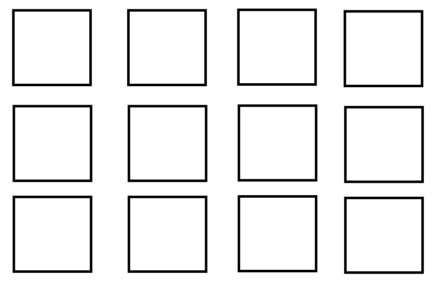

# special-diagramations

componente que te permitira usar grillas y administrarlas desde backoffice



## Configuration 

1. Añade a tu `manifest.json` la dependencia `itgloberspartnercl.special-diagramations`;
2. Para declarar este componente debes configurar las siguientes propiedades.


## Use
```json

{
  "custom-grid": {
        "props": {
            "gridType": 3,
            "gap":14,
            "marginTop":10,
            "marginBottom":40
        },
        "children": [
            "flex-layout.row#item1",
            "flex-layout.row#item2",
            "flex-layout.row#item3",
            "flex-layout.row#item4",
            "flex-layout.row#item5",
            "flex-layout.row#item6"
        ]
    }
}

```

### `custom-grid` props

| Prop name    | Type            | Description    | Default value |
| ------------ | --------------- | -------------- | -------------- |
| `gridType`      | `anum`       | Cantidad de columnas <br/>para la grilla los valores <br/> permitidos son numeros<br/> del `1` al `12`  | `1`
| gap | `number` | Pixeles de diferencia<br/> entre un elemento y otro | `5`
| marginTop | `number` |Margen superior de este elemento | `10`
| marginBottom | `number` |Margen inferior de este elemento | `10`


EL propiedad `ch` es: 

- `object`


- `bullet` object:

| Prop name | Type | Description | `required` |
| --------- | ---- | ----------- | ---------- |
 | `image`      | `string`       | url de la imagen que se desea mostrar         | `true`|
| `titleBullet`      | `string`       | Titulo del bullet         |    `true`     |
| `link`      | `objetc`       | este atributo recibe un `objetc` tipo Link         |      `true`   |


La propiedad `Link` es: 
- `object`


- `bullet` object:

| Prop name    | Type            | Description    | Required                                                                                                                         |
| ------------ | --------------- | --------------------------------------------------------------------------------------------------------------------------------------------- | ---------- | 
| `url`      | `string`       | url de la imagen que se desea mostrar         |    `true` |
| `attributeNofollow`      | `boolean`       | Permitir hacer seguimiento al link|     `false`    |
| `openNewTab`      | `boolean`       | abrir una nueva pestaña         |     true    |


## Customization


| CSS Handles |
| ----------- | 
| `bullet_container` | 
| `bullet__link` | 
| `bullet__item` | 
| `bullet__image` | 
| `bullet__title` |


